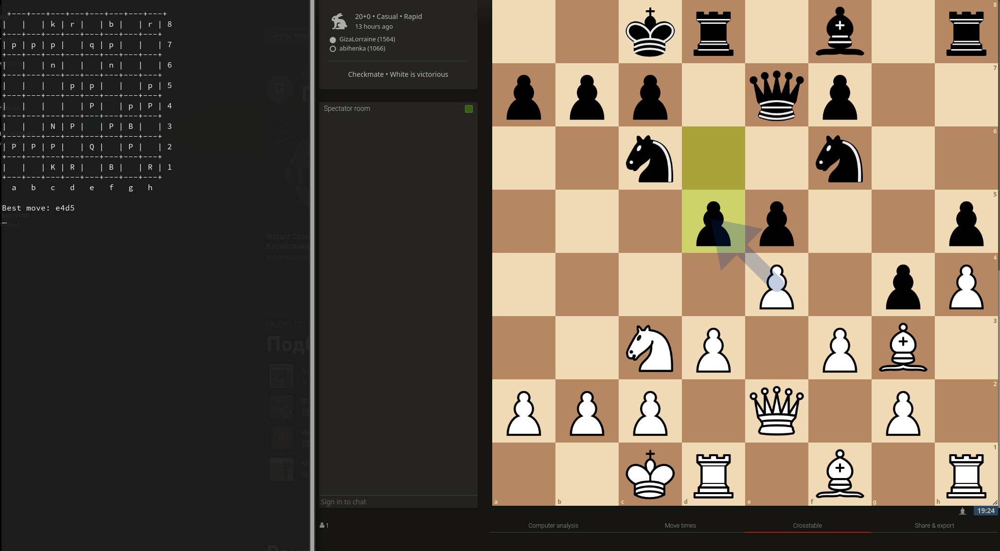

<h1>Chess Board Image Recognition and Move Prediction</h1>

This project uses computer vision techniques and a trained neural network to recognize the chessboard in a given image, predict the positions of the chess pieces, and then use the Stockfish chess engine to suggest the best move for the next player.

This script is intended for educational purposes and is not intended for cheating. It is meant to demonstrate the use of computer vision and machine learning techniques in detecting a chessboard and predicting the position of chess pieces on it, as well as to show how to interface with a chess engine to suggest the best move based on the current board state. It should not be used to gain an unfair advantage in chess games.

<h3>Installation</h3>

Clone the repository:

    $ git clone https://github.com/atljh/LoliChess.git
    $ cd LoliChess

<h3>Install the required dependencies:</h3>

    $ pip install -r requirements.txt

Download the Stockfish chess engine from stockfishchess.org/download/ and copy the binary file to the project directory.
Paste stockfish binary file path and recognition model path to .env file

<h3>Usage</h3>

To run the program, execute the following command:

    $ python chessbot.py

The program will wait for you to provide an image file path. Once the path is provided, it will recognize the chessboard, predict the positions of the pieces, and suggest the best move.

